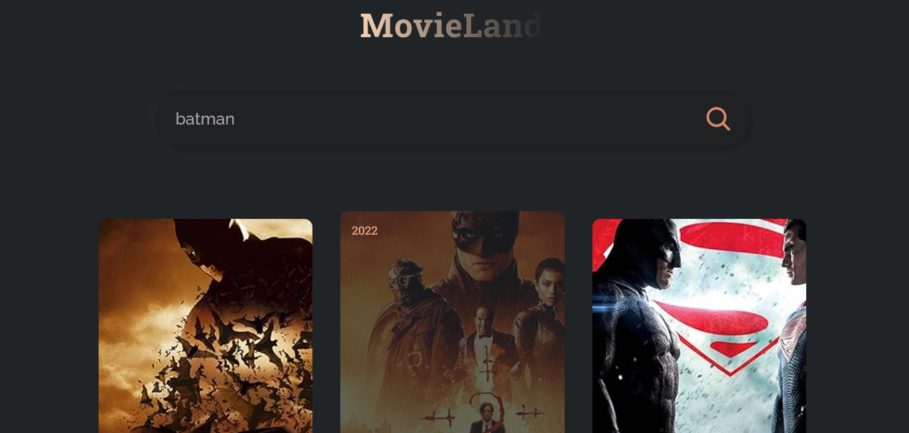

# Movieland 🎬

A React-based movie search application that uses the **OMDb API** to fetch and display movie details.  
Built while learning React and working with APIs.

## Features
- 🔍 Search movies by title
- 🎥 Fetch results from OMDb API
- 📱 Responsive design

## Tech Stack
- React
- JavaScript (ES6+)
- HTML, CSS
- OMDb API

## Screenshots

